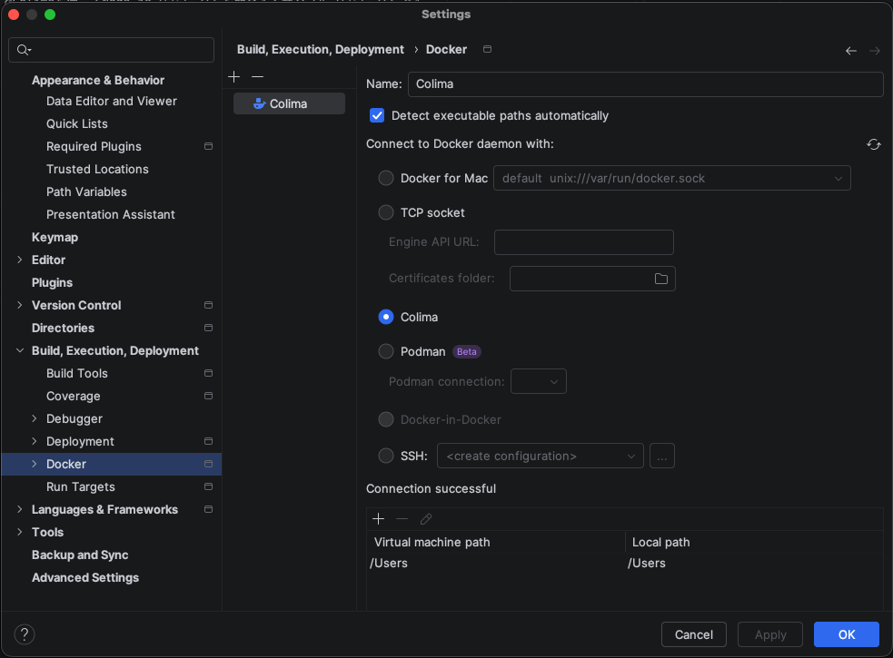
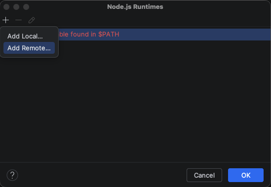
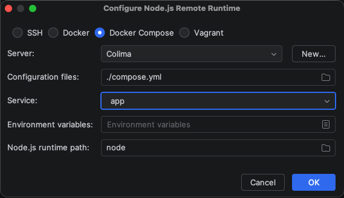
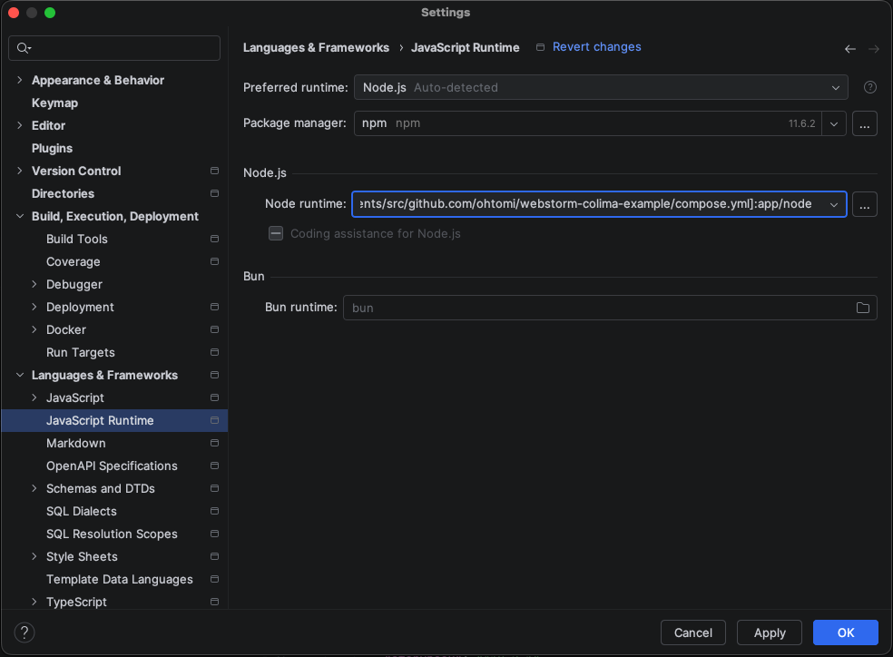
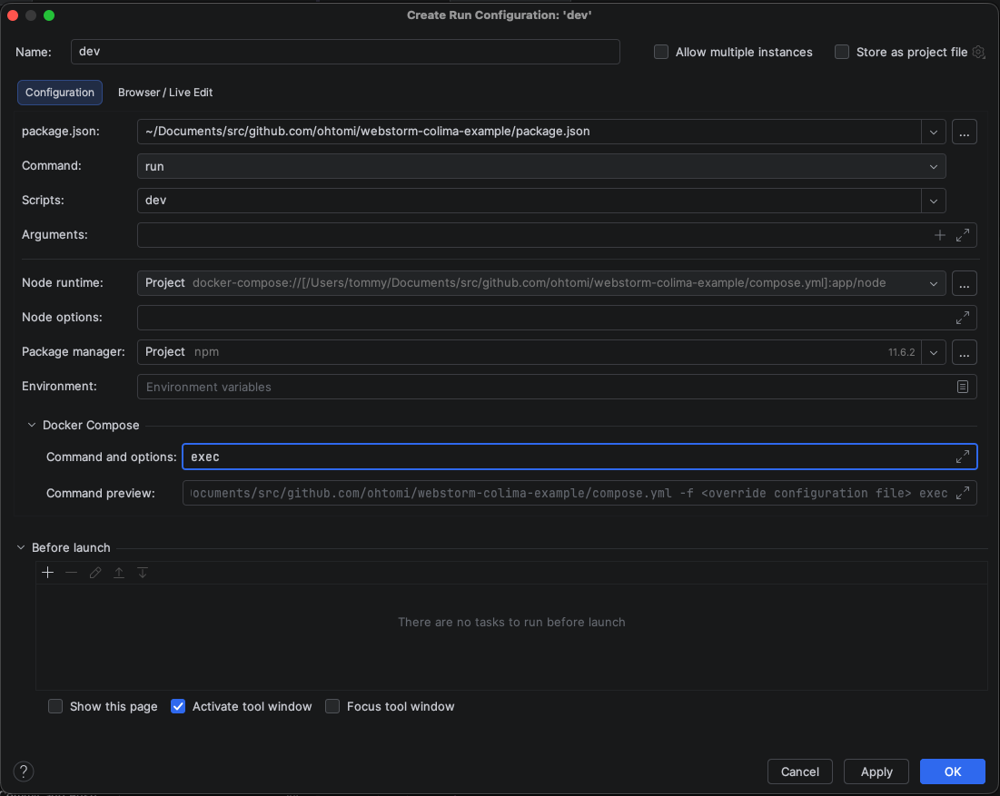

# webstorm-colima-example

これはWebStormでColimaを使ってNode.jsプロジェクトを開発するサンプルプロジェクトです。

## 動かすまでの手順

1. ColimaとDocker、Docker Composeをインストールする
   ```zsh
   brew install docker
   brew install docker-compose
   brew install colima
   ```
1. Colimaを起動する
   ```zsh
   colima start
   ```
1. Docker Composeサービスを起動する
   ```zsh
   docker compose up -d
   ```
1. WebStormを起動する
1. WebStormにColimaを認識させる
   - `Preferences > Build, Execution, Deployment > Docker`
     - 左上にある `+` ボタンをタップして、Colimaを選ぶ
     - 
1. WebStormにコンテナーのNode.jsを認識させる
   - `Preferences > Languages & Frameworks > JavaScript Runtime`
   - 中段右側にある `...` ボタンをタップして、`Node.js Runtimes` ダイアログを開く
   - 
   - 左上にある `+` ボタンから `Add Remote...` を選んで、`Configure Node.js Remote Runtime` ダイアログを開く
   - 
   - `Docker Compose` を選び、`./compose.yml` を指定して、`app` サービスを選ぶ
   - 
1. npmパッケージをインストールする
   ```zsh
   npm ci
   ```
1. SvelteKitサーバーを実行する
   ```zsh
   npm run dev
   ```

> [!NOTE]
> WebStormのターミナルからnpmパッケージをインストールすると、ホスト環境へインストールされてしまう
> そのため、Servicesタブからappサービスへ接続するか、WebStormの実行構成を設定してnpmコマンドを実行する必要がある

> [!NOTE]
> SvelteKitサーバーを実行するとき、WebStormの実行構成で `Docker Compose` の `Command and options` を `exec` と設定する必要がある
> 

## プロジェクト構成

(TODO)
